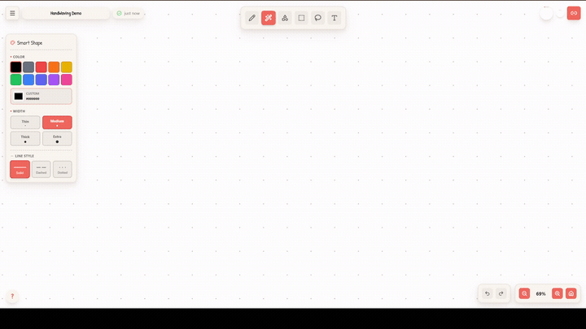
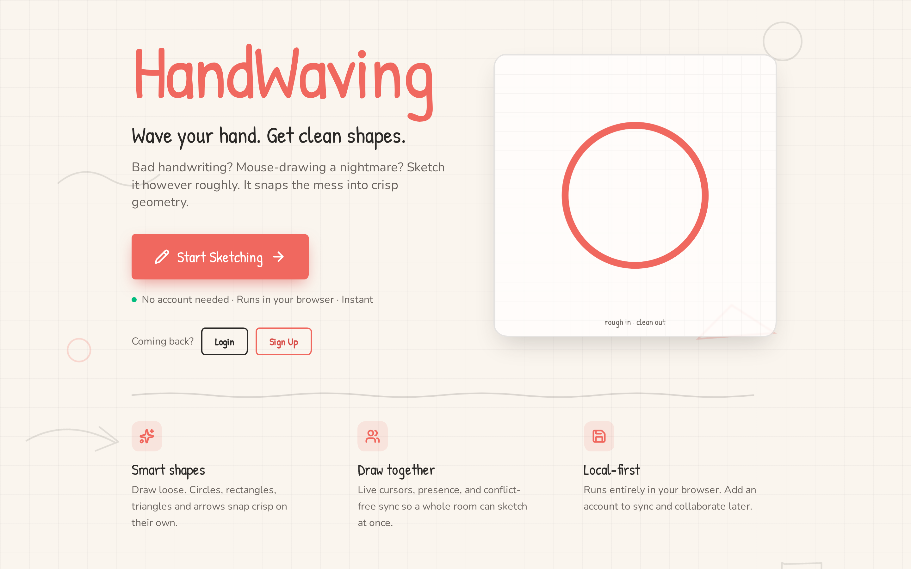
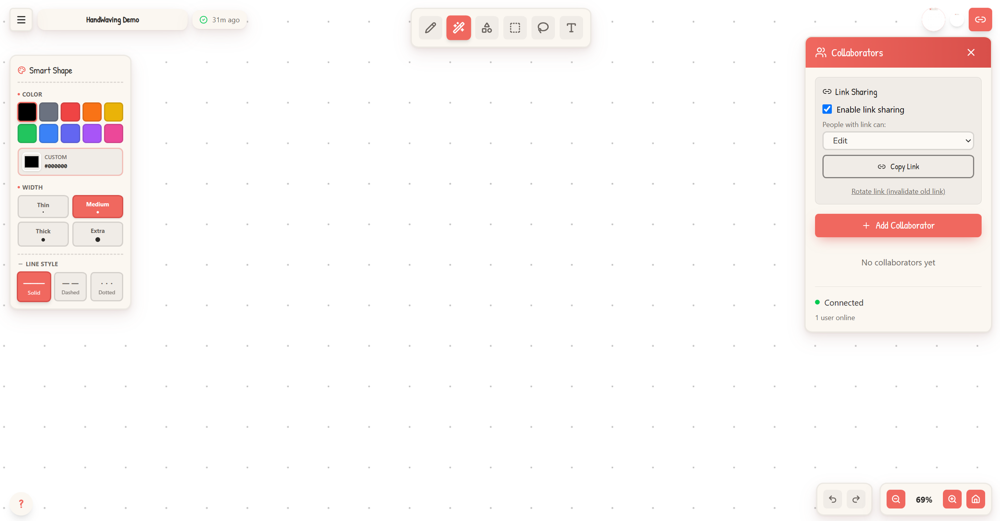

# HandWaving

A collaborative whiteboard I built to explore real-time sync and gesture recognition. You sketch a
rough freehand stroke and it classifies the result into a clean geometric shape: circle, rectangle,
triangle, line, or arrow.






---

## Why I built it

Drawing with a mouse is awkward and my handwriting is worse. Every time I wanted a quick diagram, I'd
either fight with a tool that makes you place perfect shapes one click at a time, or scribble something
unreadable. What I actually wanted was to move fast: wave my hand at the canvas, get a decent-looking
sketch back, and have my messy text come out clean too. So the whole idea is to streamline that middle
step. You be sloppy on purpose, draw a rough loop, and get a clean circle; type a label, and it reads
like a real diagram instead of a napkin.

That turned into a good excuse to work through the harder parts of a real app: multi-user sync, an undo
system that survives concurrent edits, and the geometry of turning a messy stroke into a shape you'd
actually recognize.

---

## What it does

- **Shape detection**: Classifies a freehand stroke into a basic geometric shape (circle, rectangle,
  triangle, line, straight or curved arrow). The detection is heuristic; strokes it can't classify are
  left as-is rather than forced into a shape.
- **Real-time collaboration**: Multiple people can draw on the same canvas at once, with live cursors
  and presence over Socket.IO.
- **Canvas management**: Save canvases, organize them with tags, search and filter.
- **Sharing**: Invite others by link with a role (Viewer, Editor, Admin) on top of the canvas owner.
- **Editing tools**: Select, move, resize, rotate, copy and paste. A text tool with inline multiline
  editing. Pan and zoom.
- **Export**: PNG, PDF, or JSON, with JSON re-import.



<!-- GALLERY: the gallery view needs a logged-in session. Capture it while the server is running and
     save as assets/screenshots/gallery.png, then uncomment:

-->

---

## A few things I found interesting to build

- **Operation-based sync.** Every edit is an operation (add, delete, move, resize, rotate, text) that
  knows how to undo itself. Undo and redo just replay those inverses, and the same stream of
  operations is what gets sent to everyone else in the room. So history and collaboration end up being
  the same thing under the hood, which I found clean. Conflicts fall back to whoever's timestamp is later.
- **Stroke-to-shape detection.** A stroke is first judged open or closed with a dual check (endpoint
  distance over 20px *and* an endpoint-to-path-length ratio over 0.3). Open strokes go down an arrow
  path with curvature analysis; closed strokes are compared against circle, triangle, and rectangle
  using convex-hull metrics.
- **One place for all the strokes.** Every stroke and text object lives in a single `Map` keyed by id.
  Local edits, incoming remote changes, and what gets saved to the database all read and write the same
  thing, so the two halves of the app never drift out of sync. An earlier version split this across two
  stores and it caused lots of fun bugs.

---

## Tech stack

**Frontend**: React 19, Vite 7, Tailwind CSS 4, Socket.IO client.

**Backend**: Node.js, Express, Socket.IO, PostgreSQL with Prisma.

The backend covers the usual account and access-control groundwork:

- JWT authentication with bcrypt-hashed passwords.
- Role-based permissions: owner, plus Admin / Editor / Viewer collaborators.
- Rate limiting on sensitive endpoints and Helmet security headers.
- Avatar uploads are validated and processed with sharp (SVG blocked, EXIF metadata stripped, size
  and dimension limits).
- Structured logging with Winston, including redaction of sensitive fields and environment-based log
  levels.

---

## Getting started

```bash
# Install dependencies (root, client, and server)
npm run install:all

# Set up the server environment
cp server/.env.example server/.env
# Edit server/.env and set DATABASE_URL and JWT_SECRET

# Create the database schema
cd server && npx prisma migrate dev && cd ..

# Run the client and server together
npm run dev
```

The client runs on `http://localhost:5173` and the server on `http://localhost:3001`.

### Useful scripts

| Command | What it does |
| --- | --- |
| `npm run dev` | Runs client and server together |
| `npm run build` | Production build of the client |
| `npm run lint` | Lints client and server |
| `npm run install:all` | Installs root, client, and server dependencies |

---

## Keyboard shortcuts

| Keys | Action |
| --- | --- |
| `Ctrl` + `Z` / `Ctrl` + `Y` | Undo / redo |
| `Ctrl` + `A` | Select all |
| `Ctrl` + `C` / `Ctrl` + `V` | Copy / paste at cursor |
| `Ctrl` + click | Add or remove from selection |
| `Ctrl` + drag / `Ctrl` + scroll | Pan / zoom |
| `Delete` or `Backspace` | Delete selection |
| `Escape` | Cancel the current lasso or dialog |

---

## Project layout

```
client/   React + Vite front end (canvas, drawing hooks, UI)
server/   Express + Socket.IO API, Prisma schema and migrations
```

Six database models: User, Canvas, Collaboration, Tag, CanvasTag, and Session.

---

## Known limitations

I'd rather point these out than have you find them:

- **Collaboration is best-effort.** When two people edit at the same time, whoever's change has the
  later timestamp wins. It's simple and it usually works, but it isn't a real conflict-free scheme, so
  under heavy simultaneous editing I'd expect it to drop or clobber changes. I haven't load-tested it.
- **I don't know how it scales.** I've never thrown a huge number of strokes at a single canvas, so I
  genuinely can't tell you how it holds up on memory or performance at that point.
- **Long strokes lag with collaboration on.** Draw one very long continuous line and it stutters when
  a session is live, but it's smooth offline. I think it's the extra per-frame work while others are
  connected (cursor updates, the collaborative render path) fighting with drawing, but that's a hunch,
  not something I've actually profiled.

## Where it's at

This is a personal project, and it works: you can draw, collaborate, save, and share, all the way
through. It's not production software, though. The client-side state
handling got messy as features piled on, and there are no tests to speak of.
